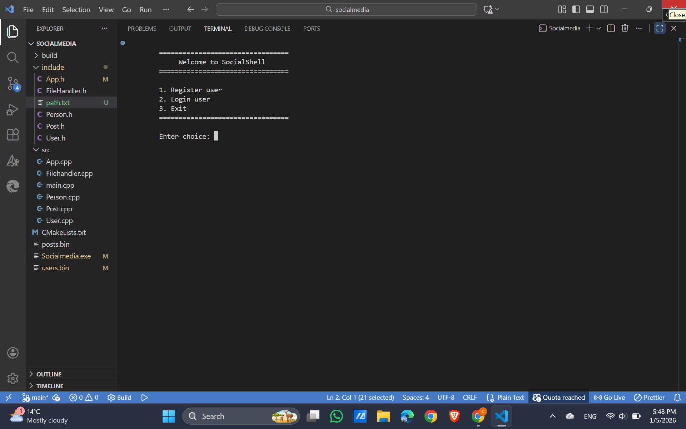
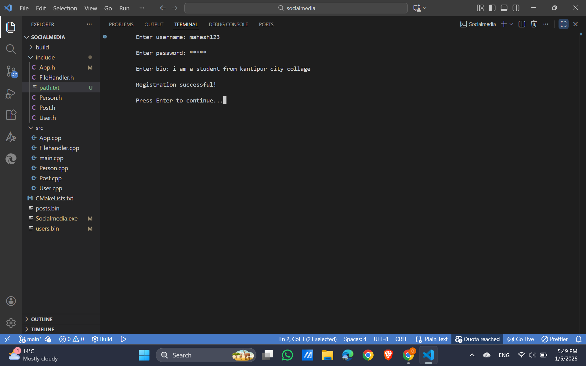
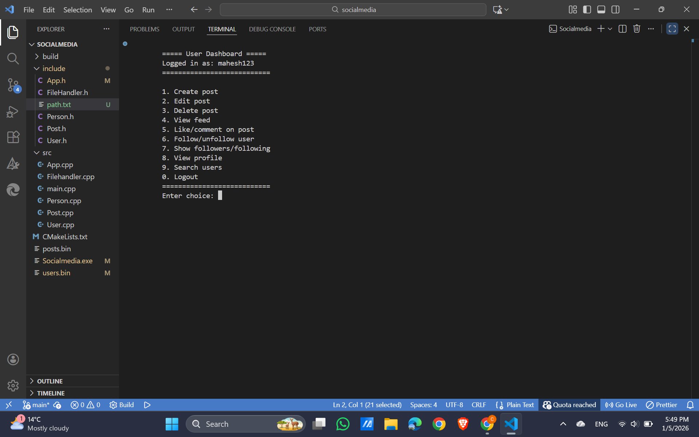
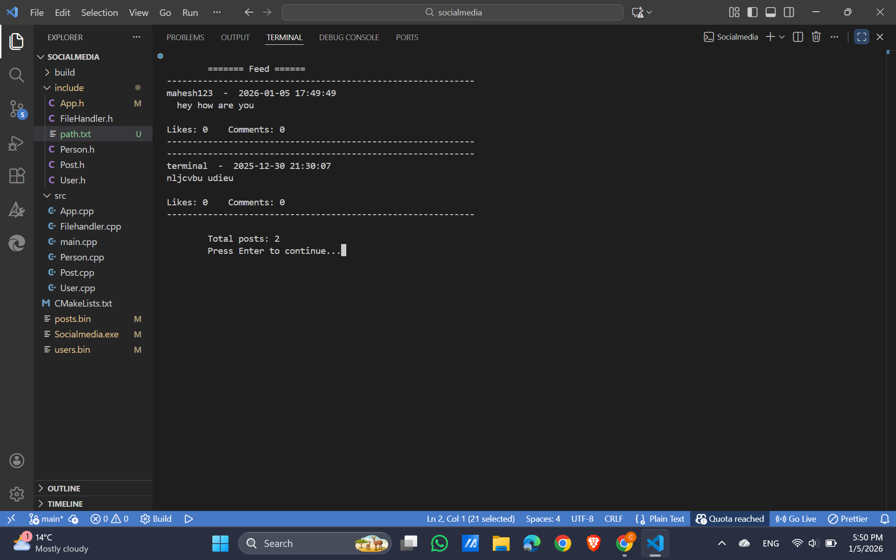
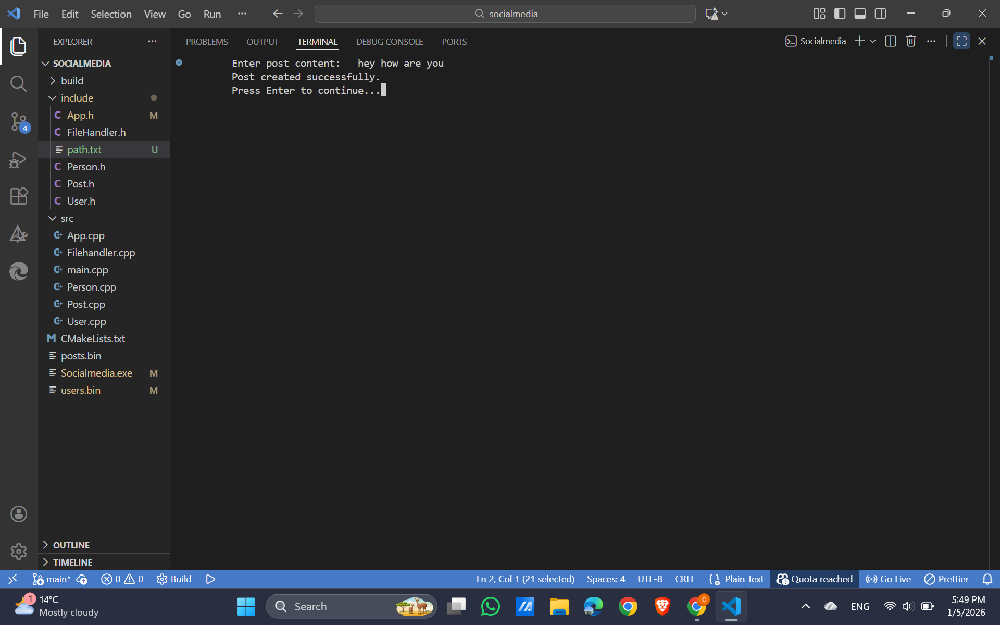

# SocialShell - Console-Based Social Media System

**SocialShell** is a C++ console-based social media application designed to simulate a simplified social network. It allows users to register, create posts, interact with others through likes and comments, follow/unfollow users, and manage their profiles — all in a secure and user-friendly interface.

---

## Key Features

| Feature | Description |
|---------|-------------|
| **User Registration & Login** | Secure user registration with hashed passwords and login with password verification. |
| **Profile Management** | Users can set/update their bio and view their profile along with followers, following, and post statistics. |
| **Post Creation** | Users can create posts with content stored with timestamp and unique post IDs. |
| **Edit & Delete Posts** | Users can edit or delete their own posts with automatic timestamp updates. |
| **Like & Comment on Posts** | Interact with posts by liking or commenting; comments are timestamped for tracking. |
| **Followers & Following System** | Follow or unfollow other users; see followers and following count and lists. |
| **User Feed** | Display all posts in reverse chronological order for a social feed experience. |
| **Search Users** | Search for users by keyword to view profiles or follow/unfollow. |
| **Binary Data Storage** | All user and post data are securely stored in binary files with backward-compatible text fallback. |
| **Password Masking** | Password input is masked for security during registration and login. |
| **Timestamp Tracking** | All posts, comments, and user logins are recorded with creation/edit timestamps. |
| **User-Friendly Interface** | Menu-driven console interface for easy navigation and interaction. |

---

## Example Usage

1. **Register a new user**
2. **Login using username and password**
3. **Create posts, like or comment on others’ posts**
4. **Follow/unfollow users and view profiles**
5. **Edit or delete your own posts**
6. **View feed and search for other users**

---
## installation & Usage Guide
C++ Compiler: A C++17 compatible compiler (e.g., GCC, Clang, MSVC).
CMake: Version 3.16 or higher.
## Build Instruction

1. Make sure you have a C++ compiler (like `g++`) installed.
2. Clone or download the project files.
3. Open terminal or command prompt in the project directory.
4. Compile the project:

```bash
mkdir build
cd build
cmake ..
cmake --build .
```
### Running the Applications
After a successful build, you can run the application from the build directory:
On windows:
```bash
.\socialmedia.exe
```
### On linux/masOS
```bash
./socialmedia

```
---
## Demo
### Login Screen

---
### Registration Screen

---
### Main Dashboard Screen

---
### remainning Function Screen


